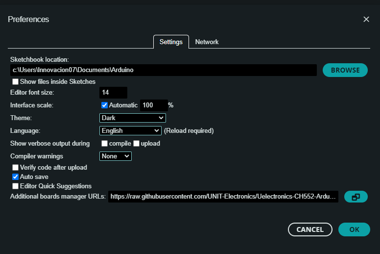

# Uelectronics-CH552-Arduino-Package

¡Bienvenido al Uelectronics-CH552-Arduino-Package! Este paquete ofrece un núcleo de Arduino que es una versión adaptada de [CH55xduino](https://github.com/DeqingSun/ch55xduino/tree/ch55xduino), basada en el trabajo realizado por [DeqingSun](https://github.com/DeqingSun). Específicamente diseñado para el microcontrolador CH55x, esta adaptación utiliza el compilador gcc para una integración sin problemas con los entornos de desarrollo de Arduino. Si estás listo para explorar este paquete más a fondo, adéntrate en los detalles a continuación sobre las placas compatibles y las instrucciones de instalación a través del Administrador de placas de Arduino. ¡Comencemos!

## Placas Compatibles
- CH552

## Instalación con el Administrador de Placas de Arduino
---
Para instalar, sigue estos pasos:

1. Abre el IDE de Arduino y navega a Archivo -> Preferencias.
2. En el cuadro de diálogo que aparece, ingresa la siguiente URL en el campo "URLs adicionales del Administrador de placas":

   > https://raw.githubusercontent.com/Cesarbautista10/Uelectronics-CH552-Arduino-Package-/main/package_duino_mcs51_index.json

   

3. Haz clic en OK para cerrar el cuadro de diálogo.
4. Ve a Herramientas -> Placas -> Administrador de placas en el IDE.
5. Escribe "CH" en el cuadro de búsqueda y selecciona "Instalar".
   
   

## Licencia
Este paquete se distribuye bajo la Licencia Pública General Menor de GNU, Versión 2.1, febrero de 1999.

## Contribuciones
Si deseas contribuir o tienes correcciones de errores, por favor abre un problema o una solicitud de extracción 

## Licencias y Créditos
* El [IDE de Arduino y ArduinoCore-API](https://arduino.cc) son desarrollados y mantenidos por el equipo de Arduino y están licenciados bajo GPL.
* El proyecto [ch55xduino](https://github.com/DeqingSun/ch55xduino/tree/ch55xduino) sirve como base para este repositorio, con actualizaciones proporcionadas por su mantenedor.
