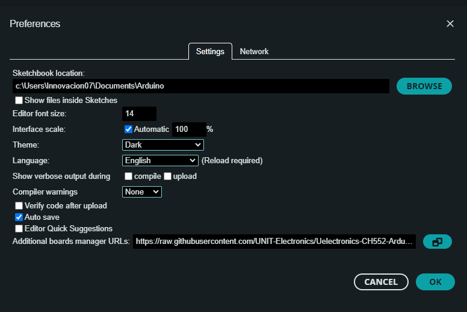
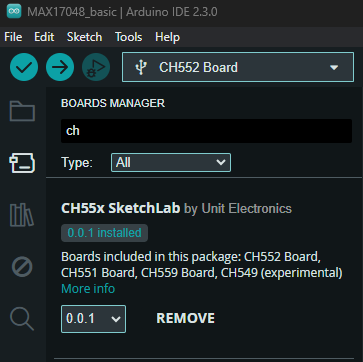

# Uelectronics-CH552-Arduino-Package v3

Welcome to the Uelectronics-CH552-Arduino-Package! This package offers an Arduino core that is a ported version of [CH55xduino](https://github.com/DeqingSun/ch55xduino/tree/ch55xduino), building upon the groundwork laid by [DeqingSun](https://github.com/DeqingSun). Specifically tailored for the CH55x microcontroller, this port utilizes the gcc compiler for seamless integration with Arduino development environments. If you're ready to explore this package further, delve into the details below on supported boards and installation instructions via the Arduino Boards Manager. Let's get started!

## Supported Boards
- CH552

## Installing with Arduino Boards Manager
---
To install, follow these steps:

1. Open the Arduino IDE and navigate to File -> Preferences.
2. In the dialog that appears, enter the following URL into the "Additional Boards Manager URLs" field: 

   > https://raw.githubusercontent.com/Cesarbautista10/Uelectronics-CH552-Arduino-Package-/main/package_duino_mcs51_index.json
   
   

3. Click OK to close the dialog.
4. Proceed to Tools -> Boards -> Boards Manager in the IDE.
5. Type "CH" in the search box and select "Install".
   
   

## License
This package is distributed under the GNU Lesser General Public License, Version 2.1, February 1999.

## Contributing
If you wish to contribute or have bug fixes, please open an issue or pull request 

## Licensing and Credits
* The [Arduino IDE and ArduinoCore-API](https://arduino.cc) are developed and maintained by the Arduino team and are licensed under GPL.
* The [ch55xduino](https://github.com/DeqingSun/ch55xduino/tree/ch55xduino) project serves as the foundation for this repository, with updates provided by its maintainer.
